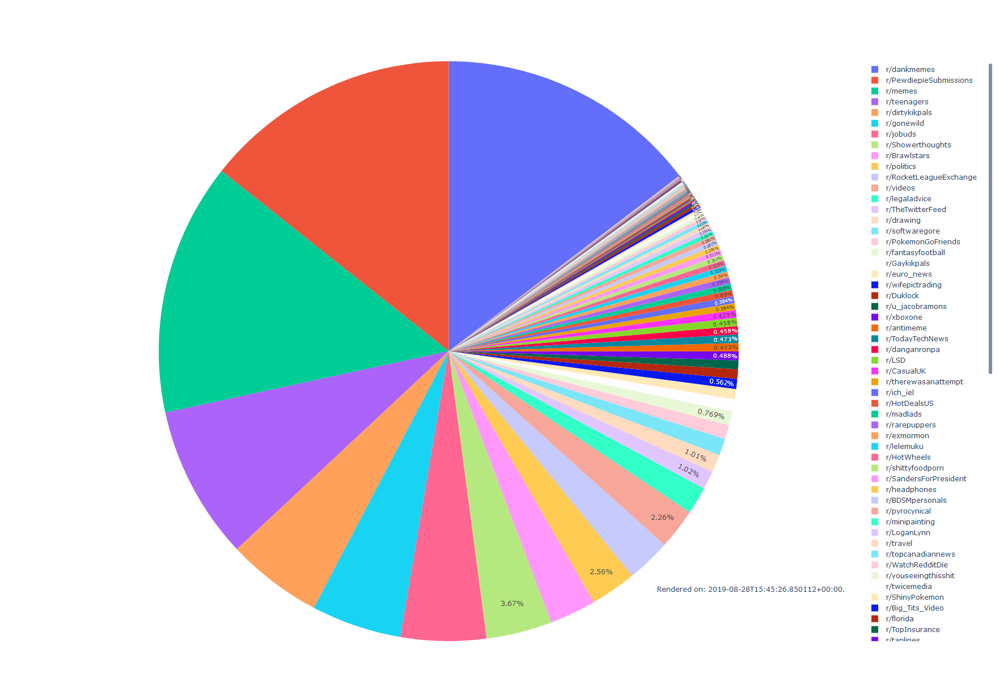

# Subreddit post count visualization

This gets every new post created on reddit, stores the subreddit of the post, and creates a pie chart with that data

[Live Example](http://redditpie.laurinneff.ch/piechart.html)